# SmartUCX Database ERD (db_ucx)

This document contains the Entity Relationship Diagram (ERD) for the `db_ucx` database, representing the latest schema and the current **mockup data** structures for pending features.

## Overview

The database is structured into four main functional areas:
1. **Organization**: Customer hierarchy and physical locations.
2. **Connectivity & Routing**: Servers, trunks, routes, and physical/virtual connections.
3. **Features**: PBX features like IVR, Ring Groups, Conferences, etc. (Some currently mocked).
4. **Administration**: Users, groups, and activity/system logging.

## ERD Diagram (Mermaid)

```mermaid
erDiagram
    %% Organization Group
    CUSTOMERS ||--o{ HEAD_OFFICES : "owns"
    CUSTOMERS ||--o{ BRANCHES : "owns"
    CUSTOMERS ||--o{ SUB_BRANCHES : "owns"
    HEAD_OFFICES ||--o{ BRANCHES : "manages"
    HEAD_OFFICES ||--o{ CALL_SERVERS : "hosts"
    BRANCHES ||--o{ SUB_BRANCHES : "contains"

    %% Connectivity Group
    CALL_SERVERS ||--o{ EXTENSIONS : "configures"
    CALL_SERVERS ||--o{ TRUNKS : "configures"
    CALL_SERVERS ||--o{ SBCS : "configures"
    CALL_SERVERS ||--o{ IVR : "hosts"
    CALL_SERVERS ||--o{ RING_GROUPS : "configures"
    CALL_SERVERS ||--o{ TIME_CONDITIONS : "manages"
    CALL_SERVERS ||--o{ CONFERENCES : "manages"
    CALL_SERVERS ||--o{ INTERCOMS : "manages"
    CALL_SERVERS ||--o{ INBOUND_ROUTINGS : "handles"
    CALL_SERVERS ||--o{ OUTBOUND_ROUTINGS : "handles"
    
    BRANCHES ||--o{ INTERCOMS : "assigned_to"

    %% Feature Relations
    IVR ||--o{ IVR_ENTRIES : "contains"
    ANNOUNCEMENTS ||--o{ IVR : "primary_recording"
    RECORDINGS ||--o{ IVR : "various_options"

    %% Mocked Entities (UI Only)
    CALL_SERVERS ||--o{ BROADCASTS : "mock_config"
    CALL_SERVERS ||--o{ MUSIC_ON_HOLD : "mock_config"
    CALL_SERVERS ||--o{ STATIC_ROUTES : "mock_config"
    CALL_SERVERS ||--o{ FIREWALL_RULES : "mock_config"

    %% Admin & Logs
    CMS_USERS ||--o{ ACTIVITY_LOGS : "performed_by"
    CMS_GROUPS ||--o{ CMS_USERS : "defines_role"

    %% Table Definitions
    CUSTOMERS {
        int id PK
        string name
        string code
    }
    HEAD_OFFICES {
        int id PK
        int customer_id FK
        string name
        string type "basic, ha, fo"
    }
    BRANCHES {
        int id PK
        int customer_id FK
        int head_office_id FK
        int call_server_id FK
        string name
    }
    CALL_SERVERS {
        int id PK
        int head_office_id FK
        string name
        string host "IP Addr"
    }
    EXTENSIONS {
        int id PK
        int call_server_id FK
        string extension
        string name
    }
    IVR {
        int id PK
        int call_server_id FK
        string name
        int announcement FK
    }

    %% Mocked / Pending Tables
    BROADCASTS {
        int id PK
        string name
        string extension
        string audio_file
        string[] extensions
    }
    MUSIC_ON_HOLD {
        int id PK
        string name
        string mode
        string directory
    }
    STATIC_ROUTES {
        int id PK
        string destination
        string gateway
        string interface
    }
    FIREWALL_RULES {
        int id PK
        string name
        string protocol
        string port
        string action
        int priority
    }

    ACTIVITY_LOGS {
        int id PK
        int user_id FK
        string action
        string entity_type
    }
```

## Functional Groups Detail

### 1. Organization
- **Customers**: Root entity representing clients.
- **Head Offices**: Regional hubs and main configuration points.
- **Branches**: Physical locations.

### 2. Connectivity
- **Call Servers**: Core PBX engines.
- **Trunks**: External connectivity.
- **SBCs**: Session Border Controllers.

### 3. Features (Mockup Data)
The following features are currently implemented using **mockup data** in the Angular frontend:
- **Broadcast**: Group announcements/paging.
- **Music on Hold (MOH)**: Audio playlists for held calls.
- **Paging & Intercom**: Direct extension paging.
- **Recording**: Call recording management.
- **Ring Group**: Distribution strategies for incoming calls.
- **Time Conditions**: Time-based routing.

### 4. Network (Mockup Data)
- **Static Route**: OS-level network routing.
- **Firewall Rules**: Security rules for the PBX host.

> [!IMPORTANT]
> Tables marked as **Mocked** in the diagram or list above do not yet have corresponding tables in the `db_ucx` production schema. Their structures are based on current UI requirements.
